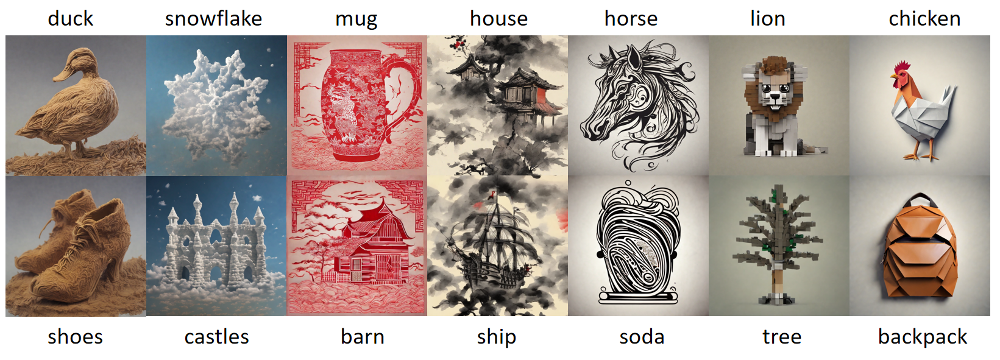

# Jittor-小鹰抓大鸡-计图风格迁移挑战赛


## 简介
本项目是第四届计图挑战赛赛题二中,“小鹰抓大鸡”战队获得第五名的代码实现。项目的主要贡献和特点包括：

- **风格信息捕捉**: 
  - 针对Dreambooth-Lora方法框架中风格信息难以有效捕捉的问题，本项目采用了具有明确语义的词汇作为标识符，以增强模型对风格信息的理解。
  
- **数据增强**: 
  - 针对赛题中小样本设置带来的数据稀疏问题，通过数据增强技术提升训练数据分布的多样性，从而提高模型的泛化能力。
  
- **语言漂移问题**: 
  - 针对生成模型中常见的语言漂移问题，本项目引入了class-specific prior preservation loss，以有效抑制类别语义信息在生成过程中的丢失，确保生成结果保持类别一致性。
  
- **生成多样性**: 
  - 针对生成模型输出多样性降低的现象，通过对类别词进行细致描述，旨在提高生成内容的多样性和丰富性。

## 安装

本项目在4090上运行，一张卡训练一个风格需要半小时。

#### 运行环境

- ubuntu 22.04.6 LTS
- python == 3.9.19
- jittor == 1.3.9.5
- CUDA == 12.1


#### 依赖安装

首先按照 [JDiffusion 的安装指导](https://github.com/JittorRepos/JDiffusion/blob/master/README.md)安装必要的依赖，除此之外还需要安装 peft 库依赖。

```python
pip install accelerate==0.27.2
pip install peft==0.10.0
```


#### 预训练模型
预训练权重（LORA）位于`./style`目录下。预训练权重已传给了比赛官方，可联系官方获取。生成时，在run.py中配置权重路径即可。


## 数据预处理：
- **图像大小调整**: 
  - 将所有输入图像统一调整为指定的尺寸（512×512）。

- **随机翻转**:
  - 以 0.5 的概率对图像进行随机的水平翻转，增加训练数据集的多样性，并增强模型对不同图像方向的鲁棒性。

- **图像归一化**:
  - 使用均值为 0.5、标准差为 0.5 的归一化操作，提高模型训练的稳定性，加速收敛。


## 训练
 
```bash
bash ./train.sh
```

## 推理
  - 使用以下命令进行图像生成：
  
```bash
bash ./run.sh
```

## 结果复现
  - 将数据集放在`./data`目录下（比如`./data/B`），原始的Stable Diffusion模型放在`./stable-diffusion-2-1`目录下
  - 运行test.py，将在`./output`目录下生成图像

## 致谢
JDiffusion .....(to be updated)

## 联系方式
- **陈军**: QQ：2829924753
- **宋奕圻**: QQ：1029277718
- **李紫慧**: QQ：2278120643